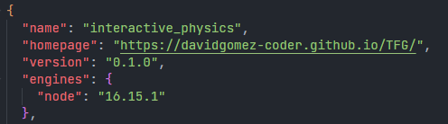
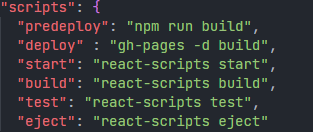
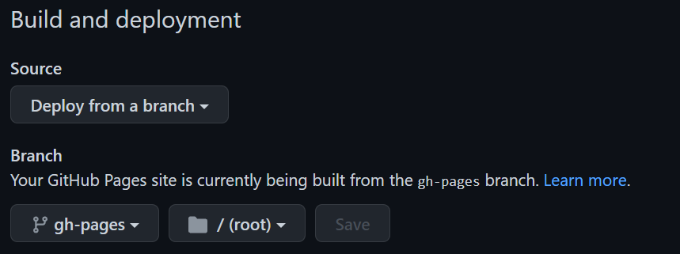

<style>
    img {
        border: 1px solid white;
    }

    img:hover {
        transform: scale(1.5);
        -webkit-transform: scale(1.5);
    }
</style>

# <p style="color:#1fa8d1">Física Interactiva</p>
"Física Interactiva" es un proyecto de fin de grado de la titulación en Ingeniería Informática de la Universidad de Málaga, cuyo principal objetivo es servir como material complementario en las asignaturas de física impartidas en cualquiera de los grados de la rama de ingeniería, arquitectura o matemáticas.

Concretamente, se propone una solución a las simulaciones de los circuitos RC y RL en corriente continua y estado transitorio, fenómenos físicos estudiados en la asignatura <i>Fundamentos Físicos de la Informática</i>. Ya que el propósito es servir como ayuda, se estudiarán los circuitos RC y RL de primer orden, y en sus respectivas simulaciones, se permitirá al alumno modificar cada uno de estos componentes, visualizar la evolución de algunas magnitudes físicas de cada fenómeno así como un apartado teórico que permitirá, entre otras cosas, establecer una base sólida de lo que ocurre en estos circuitos simulados.


## <p style="color:#1fa8d1">Guía de instalación</p>
Para poder instalar la aplicación localmente, es necesario disponer de <strong>NodeJS</strong>, un entorno en tiempo de ejecución de <i>JavaScript</i>, permitiendo la creación de aplicaciones, módulos o librerías haciendo uso de este lenguaje, teniendo este como primer objetivo ser ejecutado en el navegador. 

(Para descargar la última versión de NodeJS ir a https://nodejs.org/en/download/)

Una vez la instalación está completa y hallamos descargado el código fuente en nuestra máquina local, debemos de situarnos en el directorio padre descargado, y en él, ejecutar los siguientes comandos:

<strong>`npm install --force`</strong> : Instalación de todas las dependencias. La opción <i>--force</i> es usada para poder instalar librerías con conflictos (en caso de que los hubiese), ya que dependiendo del sistema operativo utilizado puede salir este error o no. 

Una vez hecho esto, la aplicación se encuentra lista para ser lanzada, escribiendo sobre el mismo directorio el comando <strong> `npm start` </strong> y, acto seguido, se abrirá una ventana de nuestro navegador con la aplicación (por defecto en http://localhost:3000)*.


<strong>*</strong> El codigo fuente esta configurado para desplegarse en github-pages, así que por defecto el proyecto se abrirá en http://localhost:3000/TFG. Basta con quitar la ruta <i>TFG</i> de la URL en el navegador y la aplicación se muestra correctamete.

## <p style="color:#1fa8d1">Despliegue en Github-pages</p>
Para realizar el despliegue en github-pages, realizaremos los siguientes pasos. 

En primer lugar será instalar la dependencia <i>gh-pages</i>, la cuál nos permitirá crear un <strong>build </strong> de nuestra aplicación. Este <strong>build </strong> lo desplegaremos en una rama diferente, para así tener en una el código fuente y en otra, los archivos necesarios para poder desplegar la aplicación. Instalamos entonces esta dependencia con la siguiente instrucción.

```$ npm install gh-pages --save-dev ```

Una finalizada la instalación, abrimos el fichero `package.json` y añadimos una propiedad `homepage` con el siguiente formato: `https://{username}.github.io/{repo-name}`

<div style="text-align: center">
    
</div>

<br />

A continuación, añadimos los scripts `predeploy` y `deploy` para hacer el despliegue en el fichero `package.json`.


<br/>
<div style="text-align: center">
    
</div>

<br />

Para terminar, despleguamos ejecutando el siguiente script ```$ npm run deploy``` , el cuál llamará internamente a los anteriores scripts añadidos.

Con todo esto, tendremos el proyecto dividido en dos ramas diferentes.
    
    - Por un lado la rama main que contendrá el código fuente del proyecto.

    - Rama gh-pages, con el build del proyecto

    - Para limpiar la rama gh-pages y hacer un nuevo build, en deploy se debe de utilizar 'gh-pages-clean gh-pages -d build'

Para poder acceder desde internet, nos moveremos al apartado <strong>settings</strong> 

<div style="text-align: center">
    
</div>

<br />
y en la pestaña <strong>Pages</strong> habilitamos la siguiente configuración. 

<br/>

<div style="text-align: center">
    
</div>

<br />
Guardamos los cambios y la aplicación sería accesible con el siguiente enlace
https://davidgomez-coder.github.io/TFG/ 

<br /><br />
Ⓒ2022 David Gómez Pérez


