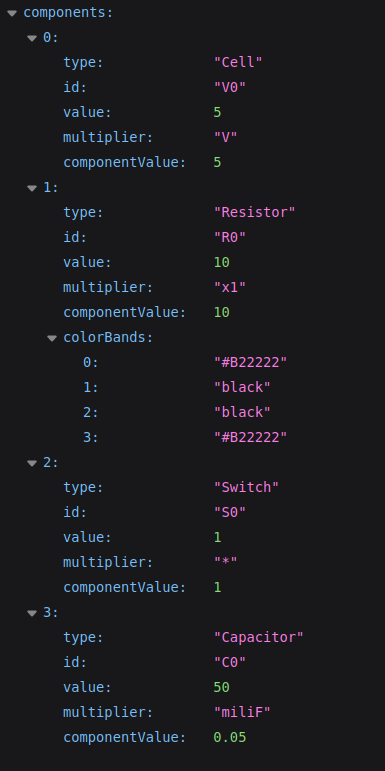

# Servidor API

## Introducción 

Este servidor se trata de un servicio basado en API REST utilizada como productora de resultados de simulaciones físicas. A diferencia de una API REST, las cuáles consumen datos alojados en una BBDD, aquí la información es generada en tiempo real por cada sesión de usuario, por lo que las instancias creadas de la simulaciones o los elementos generados durante el tiempo en el que la sesión está activa, serán borrados una vez dicha sesión haya caducado.

***

## Instalación del Servidor API
* Visitar la web de [NodeJS](https://nodejs.org/en/) para instalar la última versión.
* Descargar el código fuente del repositorio en https://github.com/DavidGomez-coder/TFG.git
* Moverse al directorio 'server' con 
``` $ cd server ```
* Instalación de las dependencias del servidor
``` $ npm install ```
* Crear variables de entorno (ver más abajo)
* Iniciar el servidor en el navegador escribiendo: _http://localhost:{PORT}_. Se recibirá un `OK` (status 200) por pantalla si el servidor se ha iniciado correctamente.

### ⚠️ Variables de entorno 
Crear en el directorio raiz un fichero con nombre **.env**. En este  fichero incluiremos todas las variables de entorno, las cuáles son utilizadas por el servidor para poder comenzar a ejecutarse. Inicialmente solamente son necesarias solamente las siguientes (escribir tal y como se muestra):

* **PORT**. Puerto utilizado por el sevidor para atender las peticiones. (En el ejemplo de uso posterior se usa el puerto _8080_)
* **SESSION_SECRET**. Valor utilizado para crear las sesiones. Se proporciona un fichero _SecretGenerator.ts_ para generar estos valores. (Se puede escribir uno al azar).

***
## Simulaciones implementadas :electric_plug:
***
## Obtener resultados de ejemplo (sobre un circuito RC Simple)

Como se ha comentado anteriormente, las peticiones a este servidor funciona de forma similar a una consola de comandos. Para ello, lo primero que tenemos que hacer es crear el circuito en nuestra sesión, y para realizamos una petición GET usando nuestro navegador a _http://localhost:8080/create/simple-RC_. Obtendremos lo siguiente:
<div style="text-align: center">
    </img>
</div>

A continuación, procedemos a actualizar alguno de sus valores. Para ello utilizaremos las _querys_ de las URLs. Por ejemplo, imaginemos que queremos actualizar el valor de la resistencia para que tenga un valor de _6.2_ Ω tenemos dos opciones. Una es actualizar solamente el atributo _value_, y otra, es modificando tanto _value_ como _multiplier_. (⚠️NOTA: El atributo _multiplier_ no se puede modificar si no se cambia también el valor de _value_).

```
http://localhost:8080/circuit/update?resistor_value=6.2
```
o bien
```
http://localhost:8080/circuit/update?resistor_value=62&resistor_multiplier=x0.1
```

***
## Lenguajes utilizados
[]()

[](https://github.com/DavidGomez-coder/TFG/github-readme-stats)

