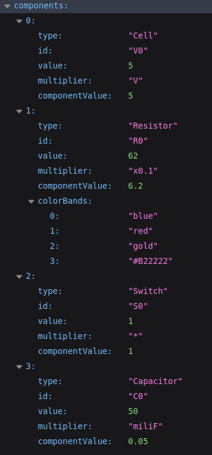

# Servidor API
## ÍNDICE
 * [Introducción](#introduccion)
 * [Instalacioón del Servidor API](#server-inst)
    * [Variables de entorno](#env-variables)
 * [Simulaciones Implementadas](#implemented-sims)
 * [Lista de peticiones](#api-rest)
 * [Pruebas unitarias](#jest-tests)
 * [Ejemplo (Simulación circuito RC)](#rc-sim-example)

 
 ***
## <a id="introduccion">Introducción</a>

Este servidor se trata de un servicio basado en API REST utilizada como productora de resultados de simulaciones físicas. A diferencia de una API REST, las cuáles consumen datos alojados en una BBDD, aquí la información es generada en tiempo real por cada sesión de usuario, por lo que las instancias creadas de la simulaciones o los elementos generados durante el tiempo en el que la sesión está activa, serán borrados una vez dicha sesión haya caducado.

***

## <a id="server-inst">Instalación del Servidor API</a>
* Visitar la web de [NodeJS](https://nodejs.org/en/) para instalar la última versión.
* Descargar el código fuente del repositorio en https://github.com/DavidGomez-coder/TFG.git
* Moverse al directorio 'server' con 
``` $ cd server ```
* Instalación de las dependencias del servidor
``` $ npm install ```
* Crear variables de entorno (ver más abajo)
* Iniciar el servidor en el navegador escribiendo: _http://localhost:{PORT}_. Se recibirá un `OK` (status 200) por pantalla si el servidor se ha iniciado correctamente.

### ⚠️ <a id="env-variables"> Variables de entorno </a> 
Crear en el directorio raiz un fichero con nombre **.env**. En este  fichero incluiremos todas las variables de entorno, las cuáles son utilizadas por el servidor para poder comenzar a ejecutarse. Inicialmente solamente son necesarias las siguientes (escribir el nombre de ellas tal y como se muestra a continuación):

* **PORT**. Puerto utilizado por el sevidor para atender las peticiones. (En el ejemplo de uso posterior se usa el puerto _8080_)
* **SESSION_SECRET**. Valor utilizado para crear las sesiones. Se proporciona un fichero _SecretGenerator.ts_ para generar estos valores. (Se puede escribir uno al azar).

***
## <a id="implemented-sims"> Simulaciones implementadas </a> :electric_plug:

- Simulación de un circuito RC simple
- Simulación de un circuito RL simple

***
## <a id="api-rest"> Lista de peticiones </a>

A continuación, se muestra una lista de las peticiones que se encuentran implementadas.

Tipo | API REST Request| Descripción
:-----:|:-----|:------------
GET  | /   | Raíz. Inicializa la sesión.
GET  |/circuit | Devuelve el circuito actual de la sesión.
GET  | /clear/circuit | Limpia el circuito usado en la sesión actual.
GET  | /circuit/create/simpleRC | Creación de un circuito RC simple.
GET | /circuit/create/simpleRL | Creación de un circuito RL simple.
GET | /circuit/sim/simpleRc | Simulación de un circuito RC simple.
GET | /circuit/sim/simpleRl | Simulación de un circuito RL simple.
GET | /circuit/update | Actualizar componentes del circuito. Pulsa <a id="queryParams">aquí</a> para ver los parámetros de consulta.

### [Parámetros usados en la actualización de un circuito RC o RL simple](#queryParams)
Parámetro| Descripción
------|------------
resistor_value | Valor de la resistencia
resistor_multiplier | Multiplicador de la resistencia
capacitor_value | Valor del condensador
capacitor_multiplier | Multiplicador del condensador
inductor_value | Valor del inductor
inductor_multiplier | Multiplicador del inductor
cell_value | Valor de la fuente
cell_multiplier | Multiplicador de la fuente
switch_value | Valor del interruptor


***
## <a id="jest-tests">Pruebas Unitarias</a> :test_tube:
Junto al código del modelo del sistema, se proporciona una serie de pruebas unitarias sobre dicho modelo para comprobar su correcto funcionamiento. Estos _tets_ unitarios se han construido usando [Jest](https://jestjs.io/), un framework construido sobre Javascript que nos permiten realizar pruebas unitarias sobre nuestro código. Además, este framework puede utilizarse con _Typescript_.

Para ejecutar las pruebas, bastaría con situarse en el directorio raíz del servidor y ejecutar
```
$ npm run tests
```
Pruebas| Resultado esperado |
--------------------------|--------------------|
La instancia de cada componente generado es correcta | OK
El valor del componente es el esperado de acuerdo con su valor y el multiplicador | OK

***
## <a id="rc-sim-example" > Obtener resultados de ejemplo (sobre un circuito RC Simple) </a>

Como se ha comentado anteriormente, las peticiones a este servidor funciona de forma similar a una consola de comandos. Para ello, lo primero que tenemos que hacer es crear el circuito en nuestra sesión, y para realizamos una petición GET usando nuestro navegador a _http://localhost:8080/circuit/create/simpleRC_. Obtendremos lo siguiente:
<div style="text-align: center">
    </img>
</div>

A continuación, procedemos a actualizar alguno de sus valores. Para ello utilizaremos las _querys_ de las URLs. Por ejemplo, imaginemos que queremos actualizar el valor de la resistencia para que tenga un valor de _6.2_ Ω tenemos dos opciones. Una es actualizar solamente el atributo _value_, y otra, es modificando tanto _value_ como _multiplier_. (⚠️**NOTA**: El atributo _multiplier_ no se puede modificar si no se cambia también el valor del parámetro _value_).

```
http://localhost:8080/circuit/update?resistor_value=6.2
```
o bien
```
http://localhost:8080/circuit/update?resistor_value=62&resistor_multiplier=x0.1
```
El resultado obtenido debería de ser el mostrado a continuación:
<div style="text-align: center">
    </img>
</div>

Para obtener los resultados de la simulación del circuito de ejemplo, bastaría con realizar la siguiente petición (Es posible que el objeto JSON devuelto puede que sea demasiado grande debido a que se generan muchos datos):
```
http://localhost:8080/circuit/sim/simpleRc
```


***

